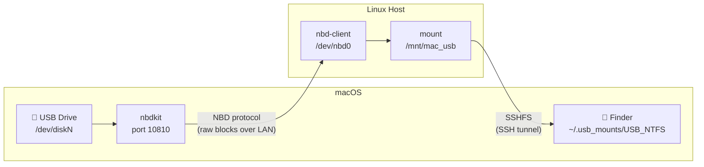
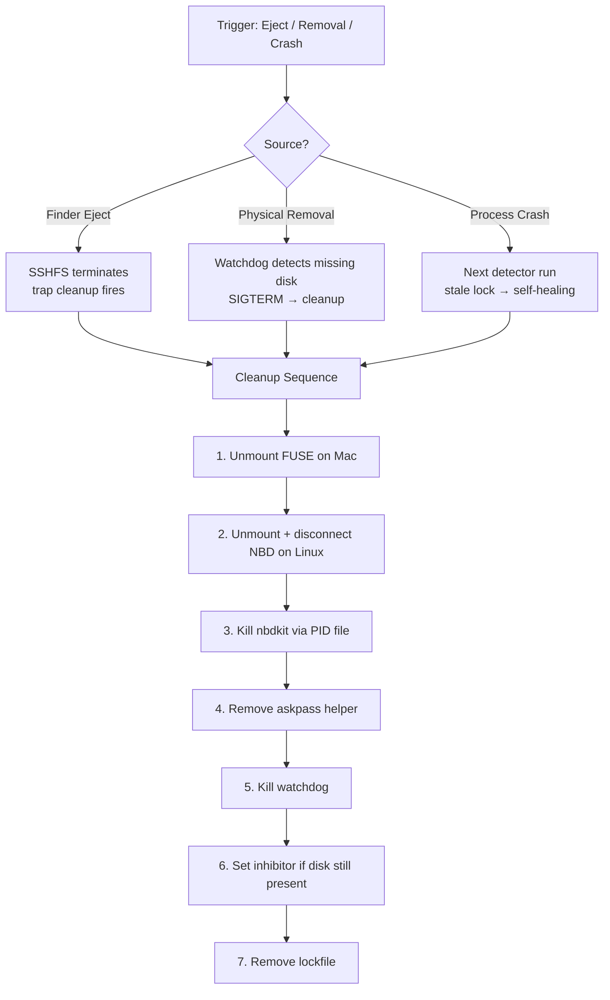

# 🔌 NBD-SSHFS Tunnel

**Mount NTFS / ext2/3/4 USB drives with full read-write access on macOS — by tunneling raw block devices through a Linux host on your local network.**

-blue)
-green)


---

## The Problem

macOS mounts NTFS as **read-only**, and ext2/3/4 are **not supported at all**. On modern macOS (especially Apple Silicon), your options are grim:

- **Apple's hidden NTFS write**: Removed entirely in recent macOS versions. Mounty and similar tools are dead.
- **Local ntfs-3g via macFUSE**: Notoriously slow, brittle, frequent kernel panics after macOS updates.
- **Paragon / Tuxera**: Commercial ($$$), often breaks after macOS updates, requires kernel extensions.
- **VM USB passthrough (UTM/QEMU)**: Apple Silicon fights the VM for USB control — constant disconnects, unreliable.

**The core issue:** macOS doesn't have reliable, performant filesystem drivers for non-Apple formats. Linux does.

## The Solution

Instead of fighting macOS, **offload the filesystem work to a Linux machine on your LAN**.

The USB drive stays physically plugged into your Mac. Its raw block device is exported over the network via [NBD](https://en.wikipedia.org/wiki/Network_block_device) to a Linux host (Raspberry Pi, NAS, VM — anything running Linux). Linux mounts it natively with full R/W support, and the mounted directory is tunneled back to macOS via SSHFS. The drive appears as a **regular volume in Finder** with a standard Eject button.



**Why not just plug the USB directly into the Linux machine?**
Because your Mac is on your desk, and your Linux box is a headless Raspberry Pi in a closet, a NAS on a shelf, or locked in a server room. This setup lets you physically insert a flash drive into your Mac while the remote Linux machine handles the filesystem seamlessly in the background.

## Features

- **Full read-write access** to NTFS, ext2, ext3, ext4 on macOS
- **Finder integration** — volume appears in sidebar with native Eject button
- **Auto-detection mode** — NTFS drives tunneled automatically on insertion (via `launchd`)
- **Watchdog** — background process monitors USB physical presence; auto-cleanup on removal
- **Self-healing** — stale locks, zombie processes, and orphaned mounts cleaned up automatically on next run
- **Orphan protection** — `nbdkit` runs inside a root helper that monitors the parent process; if the parent dies, nbdkit is killed automatically (no sudo needed for Eject)
- **Atomic locking** — `mkdir`-based lock prevents duplicate sessions per disk
- **Inhibitor mechanism** — prevents re-mount loops after Eject while the disk is still physically connected
- **Optimized SSHFS** — hardware-accelerated cipher (`aes128-gcm`), 1 MB read/write buffers, `noappledouble` to prevent `.DS_Store` pollution
- **Graceful degradation** — physically yanking the drive triggers orderly cleanup (SSHFS → NBD → nbdkit teardown)

## Performance

Data makes a round-trip over your LAN: Mac → NBD (raw blocks) → Linux → SSHFS (file data) → Mac.

- **Gigabit Ethernet**: 30–50 MB/s _(Bottleneck: Linux CPU handling NTFS processing + SSH encryption)_
- **Wi-Fi 5/6**: 10–25 MB/s _(Bottleneck: Wireless overhead + signal quality)_

Sufficient for everyday tasks: backups, document transfers, media copying. SSHFS is hardcoded to use `aes128-gcm` (hardware-accelerated) and 1 MB I/O buffers for maximum throughput.

## Quick Start

> **⏱ Budget 30–60 minutes for the first-time setup** (some packages compile from source, macFUSE requires a reboot). After that — it's plug and play.

### Prerequisites

#### macOS

1. **[Homebrew](https://brew.sh)** — install if missing:
   ```bash
   /bin/bash -c "$(curl -fsSL https://raw.githubusercontent.com/Homebrew/install/HEAD/install.sh)"
   ```

2. **nbdkit** — must be built from source (`brew install nbdkit` is broken on current macOS):
   ```bash
   curl -O https://download.libguestfs.org/nbdkit/1.46-stable/nbdkit-1.46.1.tar.gz
   tar xzf nbdkit-1.46.1.tar.gz
   cd nbdkit-1.46.1
   ./configure --disable-perl --disable-ocaml --disable-vddk \
     CFLAGS="-g -O2" LDFLAGS=""
   make
   sudo make install
   cd ..
   ```
   > **Note:** Version 1.46.1 was tested at the time of writing. Check the [nbdkit releases page](https://download.libguestfs.org/nbdkit/) for the latest stable version.

3. **macFUSE + SSHFS:**
   ```bash
   brew install macfuse
   ```
   > ⚠️ **Apple Silicon:** After installing macFUSE, reboot into **Recovery Mode** (hold Power button → Options → Startup Security Utility → enable *"Allow user management of kernel extensions from identified developers"*). Reboot again.

   ```bash
   brew install gromgit/fuse/sshfs-mac
   ```

4. **SSH key to Linux host:**
   ```bash
   ssh-copy-id pi    # passwordless login required
   ```

#### Linux Host (Raspberry Pi 4 / Debian 13)

```bash
sudo apt install nbd-client ntfs-3g
```

The host must be reachable from the Mac via SSH. Configure connection parameters in `tunnel.conf`:

```bash
cp tunnel.conf.example tunnel.conf
nano tunnel.conf    # edit LINUX_HOST and LINUX_USER if needed
```

(Optional) Add to `~/.ssh/config` if you need custom SSH options (like specific ports or keys):

```
Host pi
    HostName 192.168.0.173    # your Linux host's IP
    User pi
```

### Run

```bash
# Plug in an NTFS or ext4 USB drive, then:
./mount_tunnel.sh disk4 ntfs    # replace disk4 with your actual disk ID
                                # (find it with: diskutil list external)

# Verify the tunnel is working:
./test.sh
```

> [!NOTE]  
> **macOS Password Prompt:** Upon launching, a GUI dialog will ask for your local Mac administrator password. This is required to allow the script to read the raw block device. Subsequent mounts within the same session will reuse cached credentials.

The drive should appear in Finder. Click **Eject** or physically remove it — cleanup is automatic.

## Usage

### Automatic Mode (NTFS — launchd)

Create a `launchd` agent to auto-tunnel NTFS drives on insertion:

```bash
cat > ~/Library/LaunchAgents/com.user.usbdetector.plist << 'EOF'
<?xml version="1.0" encoding="UTF-8"?>
<!DOCTYPE plist PUBLIC "-//Apple//DTD PLIST 1.0//EN"
  "http://www.apple.com/DTDs/PropertyList-1.0.dtd">
<plist version="1.0">
<dict>
    <key>Label</key>
    <string>com.user.usbdetector</string>
    <key>ProgramArguments</key>
    <array>
        <string>/bin/bash</string>
        <string>/full/path/to/usb_detector.sh</string>
    </array>
    <key>StartOnMount</key>
    <true/>
    <key>StandardOutPath</key>
    <string>/tmp/usb_detector_launchd.log</string>
    <key>StandardErrorPath</key>
    <string>/tmp/usb_detector_launchd.err</string>
</dict>
</plist>
EOF

# ⚠️ Replace /full/path/to/usb_detector.sh with the actual path, then:
launchctl load ~/Library/LaunchAgents/com.user.usbdetector.plist
```

Now any NTFS drive you plug in will be automatically tunneled.

### Manual Mode (any filesystem)

```bash
./mount_tunnel.sh disk4             # auto-detect filesystem
./mount_tunnel.sh disk4 ntfs        # explicit: NTFS
./mount_tunnel.sh disk4 ext4        # explicit: ext4

# Convenience wrapper for ext4 (finds first external disk automatically):
./ext4.sh
```

## Architecture Deep Dive

### Data Flow

1. **`diskutil`**: macOS releases the USB disk (`diskutil unmountDisk`).
2. **`nbdkit`**: Exports the raw block device over LAN on port 10810, bound to the interface facing the Linux host.
3. **`nbd-client`**: Linux host attaches to the export, creating `/dev/nbd0`.
4. **`mount`**: Linux mounts the filesystem with full R/W (NTFS via `ntfs-3g`, ext* natively).
5. **`sshfs`**: The mounted directory is tunneled back to macOS, appearing in Finder.
6. **Watchdog**: Background process polls `diskutil info` every 2s; triggers cleanup on removal.

### Cleanup & Safety

The system is designed to leave **zero orphaned state**, even on crashes:



- **Inhibitor file** — after Eject, prevents the detector from immediately re-mounting the same disk while it's still physically plugged in. A background process removes the inhibitor once the disk is pulled out.
- **Orphan protection** — `nbdkit` is launched inside a root helper that monitors the parent script's PID. If the parent dies for any reason, the helper kills nbdkit automatically.
- **Self-healing** — `usb_detector.sh` detects stale locks (lock exists but no active SSHFS mount), cleans up zombie `nbdkit`, stale locks, and Linux-side mounts before starting a fresh session.

## File Reference

- **[`mount_tunnel.sh`](mount_tunnel.sh)**: Core script. Sets up the full NBD → mount → SSHFS pipeline, runs the watchdog, handles cleanup on exit/eject/removal.
- **[`usb_detector.sh`](usb_detector.sh)**: `launchd` trigger. Scans `/Volumes/*` for newly mounted external NTFS drives, includes self-healing for stale locks.
- **[`ext4.sh`](ext4.sh)**: Convenience wrapper. Finds the first external physical disk and launches the tunnel with `ext4`.
- **[`test.sh`](test.sh)**: Acceptance test. Checks tunnel status, tests write access, reviews logs, reports lock/PID state.

### Temporary Files (auto-cleaned)

- `/tmp/mount_nbd_<disk>.lock/`: Atomic lock directory (prevents duplicate sessions).
- `/tmp/nbdkit_<disk>.pid`: PID of the running nbdkit daemon.
- `/tmp/usb_inhibit_<disk>`: Inhibitor marker (prevents re-mount after Eject).
- `/tmp/askpass_<disk>.sh`: GUI password prompt helper.
- `/tmp/mount_<disk>.log`: Session log.
- `/tmp/usb_detector.log`: Detector activity log.
- `/tmp/usb_detector_debug.log`: Detector filter decisions.
- `/tmp/test_result_<timestamp>.log`: Test results.

## Troubleshooting

<details>
<summary><b>Drive doesn't appear in Finder</b></summary>

- Check SSHFS mount: `mount | grep usb_mounts`
- Ensure macFUSE is installed and its kernel extension is approved in System Settings → Privacy & Security
- Check logs: `cat /tmp/mount_disk*.log`
</details>

<details>
<summary><b>"An active process already exists" error</b></summary>

A previous session didn't clean up. Remove the stale lock:
```bash
rm -rf /tmp/mount_nbd_disk*.lock
```
</details>

<details>
<summary><b>NTFS drive not detected automatically</b></summary>

- Verify launchd agent: `launchctl list | grep usbdetector`
- Check filter log: `cat /tmp/usb_detector_debug.log`
- The drive must be recognized as `External` by `diskutil info`
</details>

<details>
<summary><b>SSH connection refused</b></summary>

- Test connectivity: `ssh -o ConnectTimeout=3 pi true`
- Verify `~/.ssh/config` has the correct hostname/IP for `pi`
</details>

<details>
<summary><b>Slow transfer speeds</b></summary>

- SSHFS uses `aes128-gcm` (HW-accelerated) + 1 MB buffers by default
- Bottleneck is typically SSH overhead; use wired Ethernet for best results
- Check Linux CPU load during transfers: `ssh pi htop`
</details>

## Tested On

- **macOS**: Sequoia 15.7 (Apple Silicon)
- **Linux Host**: Raspberry Pi 4, Debian 13 (Trixie) CLI
- **nbdkit**: 1.46.1 (built from source)
- **macFUSE**: 4.x
- **sshfs-mac**: gromgit/fuse tap

## Known Limitations

- **Single drive at a time** — hardcoded to `/dev/nbd0` on the Linux host. Multi-drive support is planned.
- **NTFS auto-detect only** — `launchd` detector triggers only for NTFS. ext* requires manual launch.
- **First-run sudo prompt** — macOS shows a GUI password dialog for `nbdkit` (raw block device access). Subsequent cycles within the same boot reuse cached credentials.
- **LAN only** — Mac and Linux host must be on the same local network.

## Roadmap

- [ ] Interactive `setup.sh` script:
  - Auto-detect path, prompt for host/user, generate and copy SSH key.
  - Automatically generate and install the `launchd` `.plist` agent.
  - Auto-trigger on launch if `tunnel.conf` is missing or incomplete.
- [ ] Mount in standard `/Volumes/` path (requires adjusting detector filters)
- [ ] Multi-drive support (`/dev/nbd0..nbd15`) — concurrent tunneling of 2+ USB drives

## Development Notes

This project was built with AI-assisted development ("vibe coding"). The architecture, system design, QA testing, and all editorial content are by the author — a systems engineer with 20+ years of infrastructure experience. LLMs assisted with code generation and drafting; the engineering decisions are human.

## License

MIT

---

*Built by a sysadmin who got tired of paying Paragon $40/year to write to a flash drive.*
